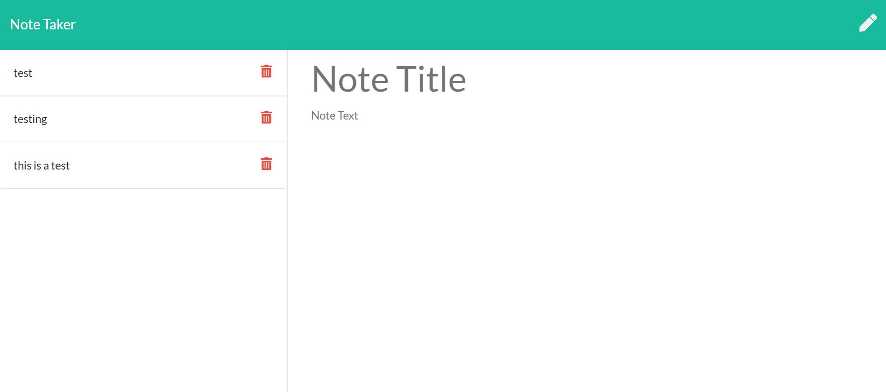

# Mnemosynes Notepad

## Description
Web app that lets you write and save notes. Named after the greek goddess for memory!

## Table of Contents
- [Description](#Description)
- [Installation](#Installation)
- [Usage](#Usage)

## Installation
To use locally, clone this repo, run 'npm i' before the first time using the app. Then use 'node server.js' to initiate the server. After that, go to ' localhost:3000/ ' in a browser and you can use the app loacally! Be aware 

## Usage
Load up the webpage. Fill in the note title and text, and once you begin to fill in the text section, you will be able to save the note by clicking the save icon in the top right of the nav bar. After you save a note it will be stored in the db and appear to the left of the editor area. If you wish to view a note, just click on the title and it will appear to the right. If you want to start a new note, click on the pencil icon in the top right of the nav bar and the area will be cleared so that you can make a new note. You can delete notes by clicking the red trashcan icon to the right of each note, which will delete that specific note. Thank you!

[link to deployed Heroku app](https://quiet-everglades-86482.herokuapp.com/)

## Licenses
None

## Contributers
TadhgMc